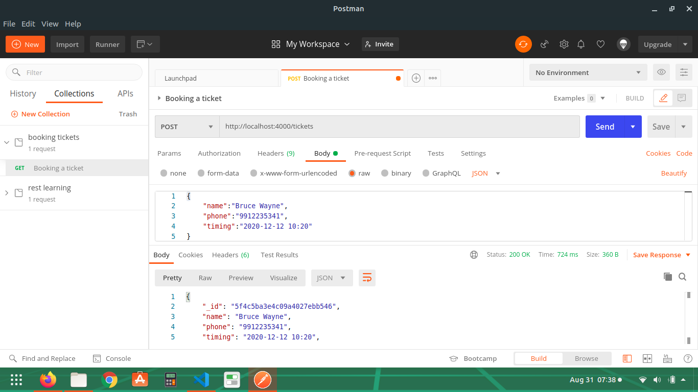
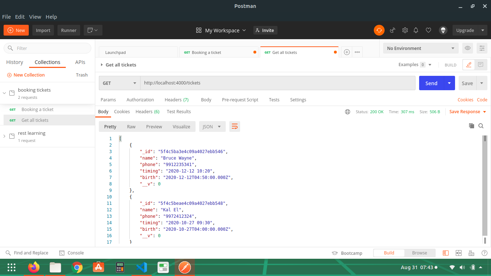
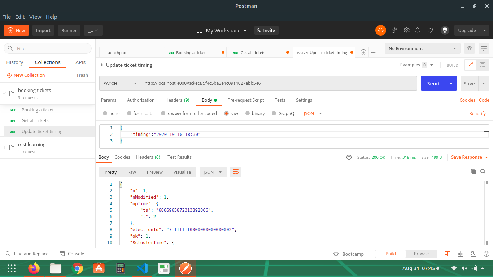
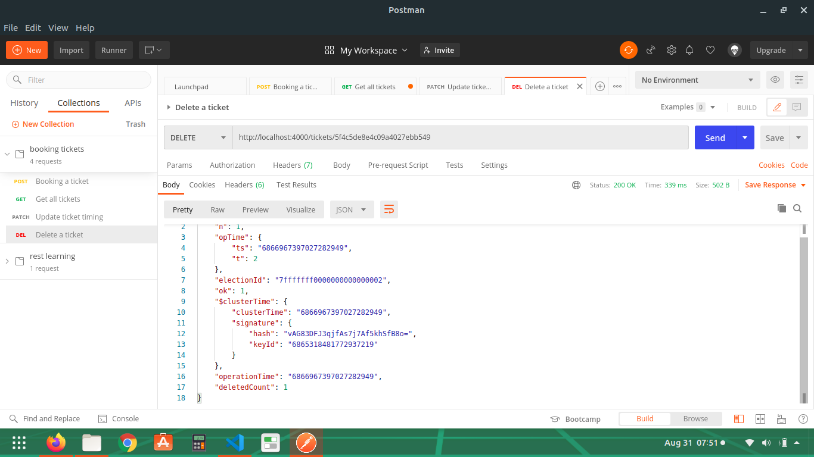
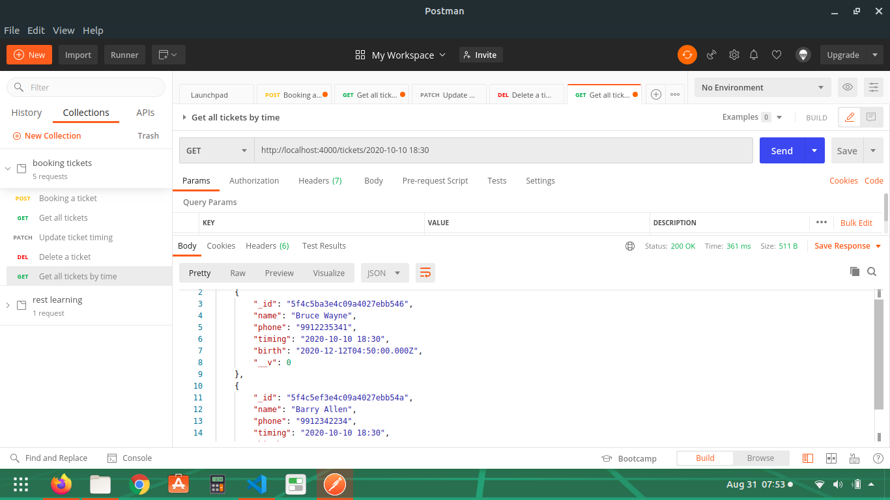
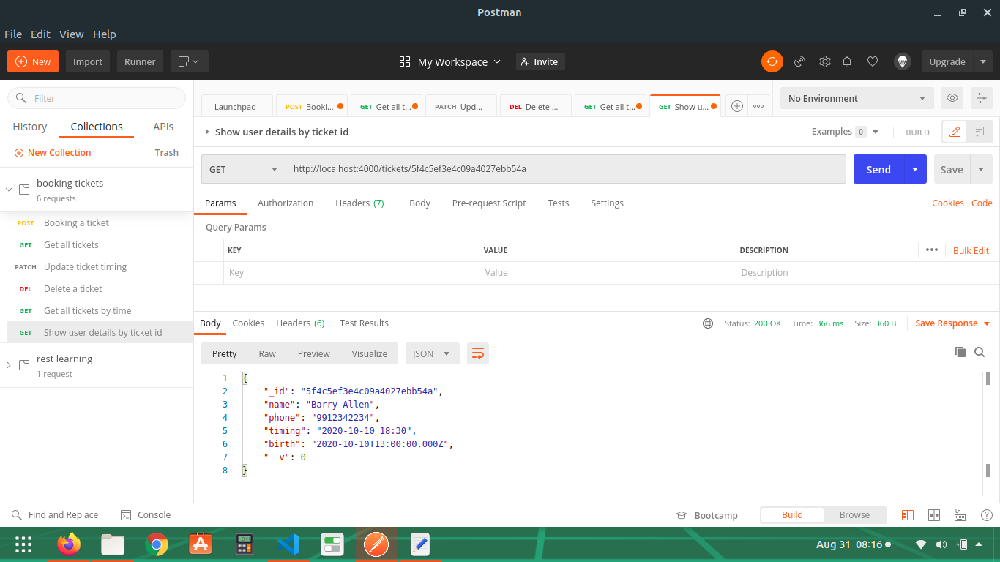

# Readme

> Note: A mongoDB atlas account is required to run this application. 

### To start the project:

```
npm start
```

### Postman Routes and Screenshots:

1. **Book Ticket**<br>

  `POST http://localhost:4000/ticket`

  

2. **Get all tickets**<br>
  
  `GET http://localhost:4000/ticket`

    

3. **Update ticket timing**<br>
    
  `PATCH http://localhost:4000/ticket/:ticket_id`

  
  
4. **Delete a ticket**<br>
  
  `DELETE http://localhost:4000/ticket/:ticket_id`

  

5. **Get all tickets by time**<br>
  
  `GET http://localhost:4000/ticket/:timing`

  

6. **Show user details by ticket id**<br>

  `GET http://localhost:4000/api/ticket/:ticket_id`

  

7. **Automated Deletion of tickets**<br>
To delete tickets automatically, cron-job has been used.
It will run every 8 hours to delete tickets that are older than 8 hours by comparing the current time with the ticket timing
